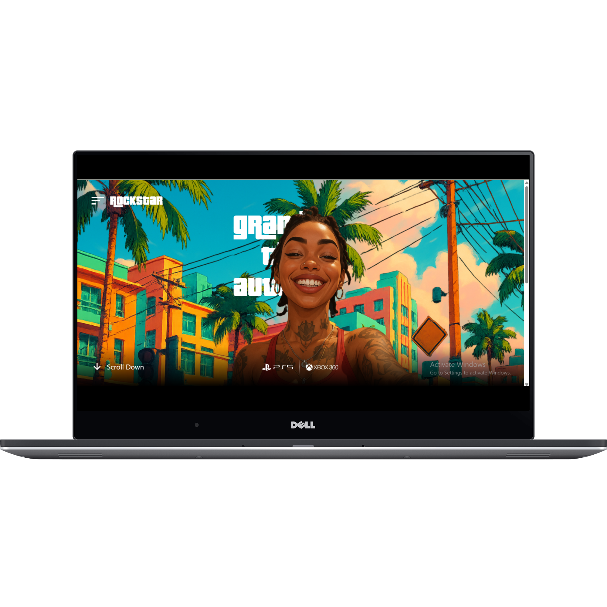

🎮 GTA-VI Landing Page

A GTA VI–inspired landing page built using React.js, GSAP, and Tailwind CSS. This project focuses on creating a visually engaging, responsive website that highlights modern frontend skills with smooth animations and game-themed visuals.

Live demo:  https://gta-vi-web-lime.vercel.app/

---

🧠 Tech Stack
React.js
Tailwind CSS
GSAP (GreenSock Animation Platform)

---

🚀 Features
Scroll-triggered animations powered by GSAP
Fully responsive design across all screen sizes
Game-style layout and visuals inspired by GTA VI
Smooth UI transitions and interactive elements

---

🎯 Project Objective
This project was developed as part of personal learning and portfolio building. It helped enhance skills in:
React component architecture
GSAP animation integration
Responsive UI/UX design with Tailwind CSS

---

🛠️ How to Run the Project

📋 Prerequisites
Node.js and npm
Git

🧾 Steps
git clone https://github.com/Zartasha-kanwal/GTA-VI.git
cd GTA-VI
npm install
npm start
